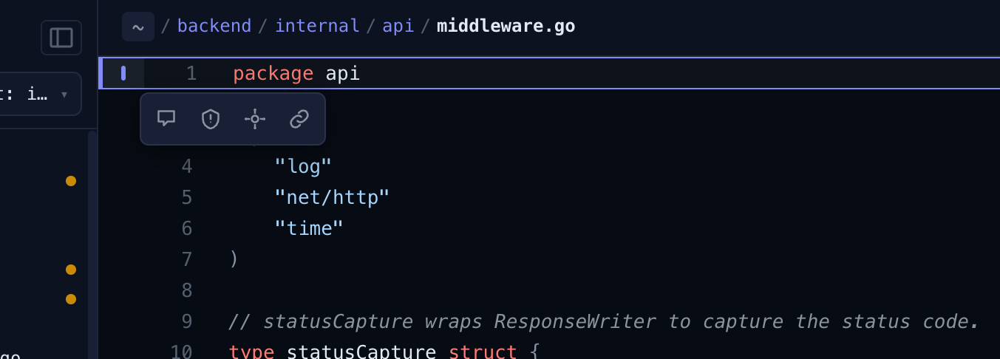
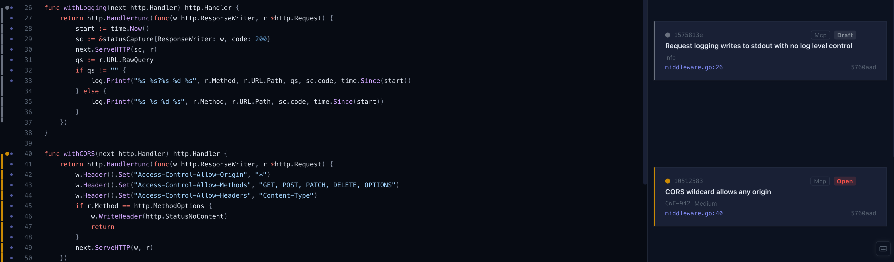

# Browse

Browse shows a single file with its annotations. Use the file tree on the left to navigate.

## Adding annotations

Select one or more lines using the gutter on the left edge. A toolbar appears with four options:

**Comment** - a free-form review note. Enter the text and submit.

**Finding** - a vulnerability or issue. Set the title and severity; optionally add a description, status, CWE, CVE, and CVSS vector/score. The file and line range are pre-filled from your selection.

**Feature** - a long-lived annotation for things worth tracking across commits: API endpoints, data sources and sinks, third-party dependencies, and other externalities. Choose a kind (`interface`, `source`, `sink`, `dependency`, `externality`), give it a title, and optionally add an operation, direction (`in`/`out`), and protocol.

**Copy link** - copies a line reference URL to the clipboard. The link is constructed from the repository's git remote, so it points directly to the selected lines on the remote host (e.g. GitHub).

## Viewing annotations

Existing annotations appear in the sidebar. Click any entry to jump to its location in the file and expand its details.

Finding severity is shown as a coloured bar spanning the annotated line range in the gutter. When multiple findings overlap, they stack horizontally.

