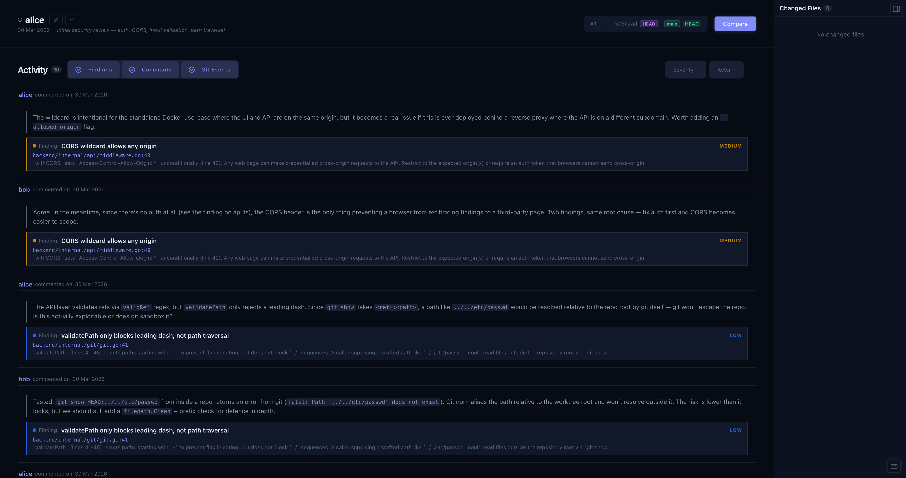

# Changes & Baselines

The Changes panel shows what has happened since your last checkpoint.

## Baselines

A baseline is a snapshot of review state at a point in time. It records every finding ID and aggregate stats, and never changes once created. Create them liberally: before starting a new module, at milestones, and at the end of a session.

To set a baseline, click **Set Baseline**. Add a reviewer name and an optional summary note.

## Delta

The panel computes what changed since the selected baseline:

- **New findings** - exist now but weren't in the baseline
- **Removed findings** - were in the baseline but have since been deleted
- **Changed files** - modified between the baseline commit and HEAD

Below the stats, an activity stream shows findings, comments, and commits in chronological order. Use the type toggles and filters to narrow it down by severity or author.

## History

Click the **History** toggle to browse past baselines (BL-1, BL-2, …) and switch between them. Select any baseline to see the delta from its predecessor - useful for reviewing what a specific round of work produced.

## Editing and deleting

Click the pencil icon on a baseline to edit the reviewer name or summary. Use the trash icon to delete it.
