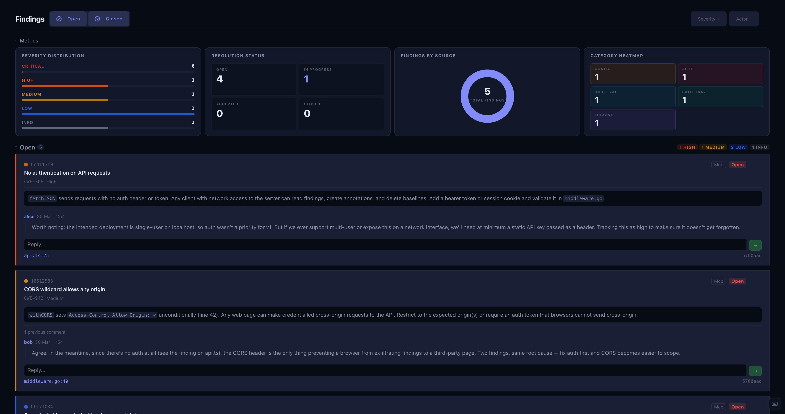

# Findings

The Findings panel lists all findings across the project. A metrics section at the top breaks them down by severity, status, category, and source.

Findings are grouped into two sections: **Open** (draft, open, in-progress) and **Closed** (false-positive, accepted, closed).

## Editing

Expand a finding card and click the edit icon to open the edit form. You can change the title, description, severity, status, source, category, CWE, CVE, and CVSS vector/score.

To cycle a finding's status without opening the full form, click the status label directly.

## Conversation

Each finding has a comment thread. Expand the finding to read the discussion and add a reply. Type in the text area at the bottom and press **Submit** or <kbd>⌘</kbd>/<kbd>Ctrl</kbd> + <kbd>Enter</kbd> to post.

Click the edit icon on any comment to revise its text, or the delete icon to remove it.

## Filtering

Use the severity and source dropdowns to narrow the list. Toggle the Open and Closed sections to focus on what's relevant.
